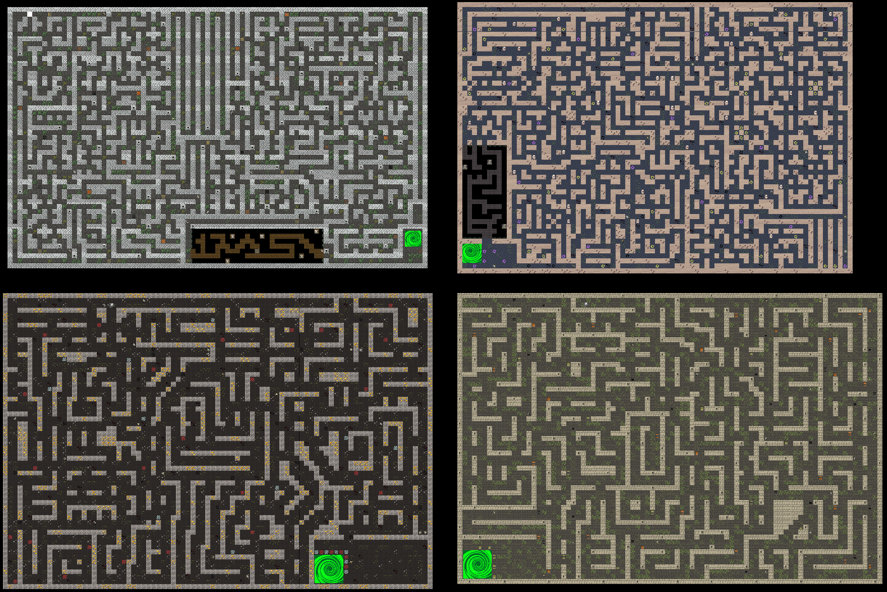
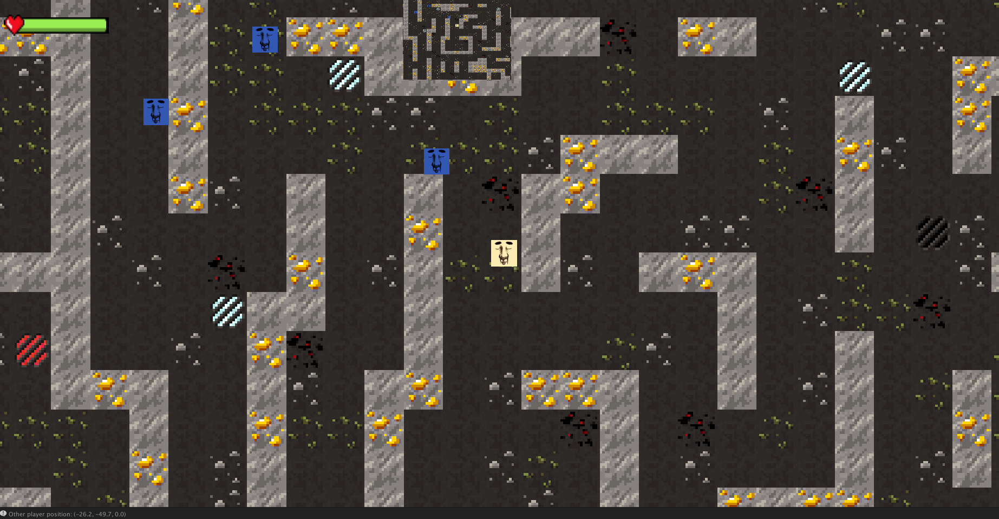
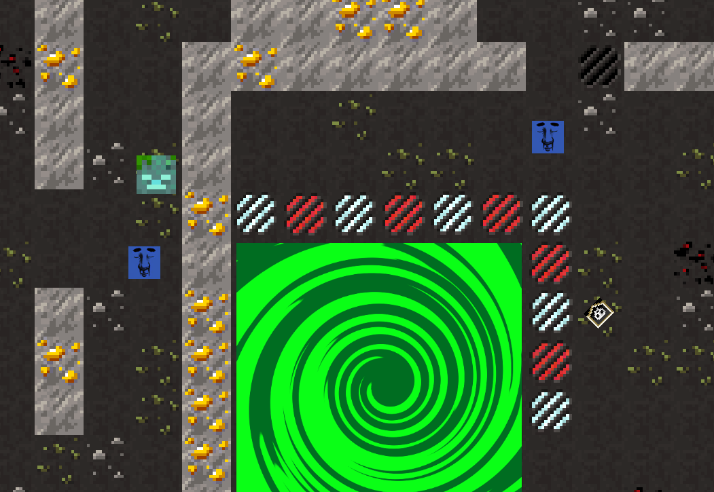
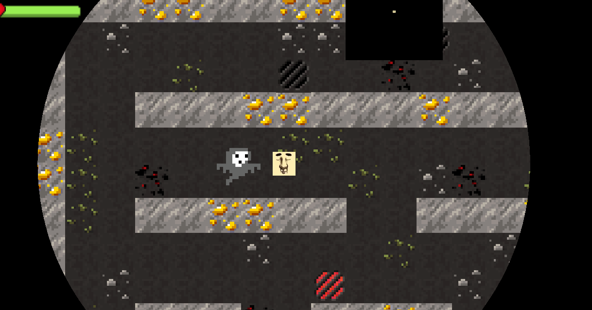
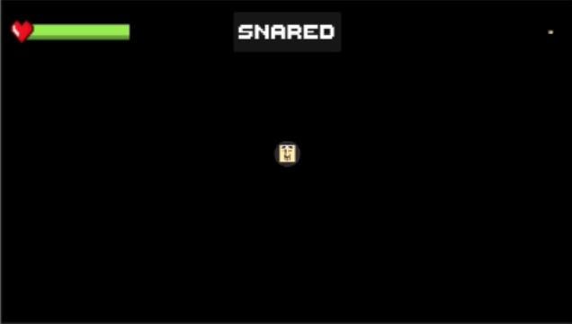

# Trapped, a multiplayer cooperative game in Unity

## Game Trailer

<iframe width="560" height="315" src="https://www.youtube.com/embed/Q6rf0KTQGeI" frameborder="0" allow="accelerometer; autoplay; encrypted-media; gyroscope; picture-in-picture" allowfullscreen></iframe>

## Description

Because of the current socially distanced situation, we wanted to create a cooperative online game friends can all enjoy together. Trapped is a multiplayer cooperative game made for WebGL where you and up to three other friends work together to navigate a maze by avoiding ghosts, traps, and other obstacles. We took inspiration from the classic Pacman, as well as dungeon crawling adventure games in terms of the look, feel, and sound effects. 

We set out to create some specific guidelines about the game. Things such as relying on your teammates for visual guidance, trap avoidance, and navigation. These emphasize the cooperative and co-dependent nature of the game. Even when a player has “died”, they’re not completely out of the game and can help aid their teammates by being human shields for traps or as a navigation aide. This way, no one is essentially left out for dying early and can still contribute toward winning.  

Mechanics include:
- Group distance calculation, which prevents players from straying too far from the group. 
- Vision limiting mechanic which restricts vision of the maze and blinds players on taking damage from certain obstacles.
- UI popup messages that inform players to certain triggers such as traps.
- Websocket multiplayer framework that synchronizes player movement, player deaths, and teleportation to next maze on level completion.

Obstacles include:
- A navmesh ghost which calculates in real time an optimal path to the players, forcing players to run or take damage. 
- Three unique traps players must avoid. 
- Balance beam sections where players must avoid falling into the pit.

Once a player dies it does not mean game over; that player becomes a zombie that moves slow and burdens the rest of the team.

### Rating

The game is appropriate for children and should be considered by ESRB as E for Everyone.

### Launch Date

The launch date for Trapped is June 12th 2020 at midnight on WebGL, accessible to all internet browsers. 

The server is currently hosted on DigitalOcean, and while the hosting is not expected to change, long-term support will likely not be available and manual restart of the server is required when an exception occurs.

Anyone may download a copy of the game, configure, and host their own server from this [repo](https://github.com/etcadinfinitum/trapped).

## Screenshots

### Overview of All Game Maps

{:width="75%"}

### Client View of a Multiplayer Game Session

{:width="75%"}

### View of Players Reaching Map Goal, Including 1 Deceased Player (Zombie)

{:width="75%"}

### View of NPC Ghost Chasing Player Through Maze

{:width="75%"}

### Client Behavior When a Trap is Activated

{:width="75%"}
